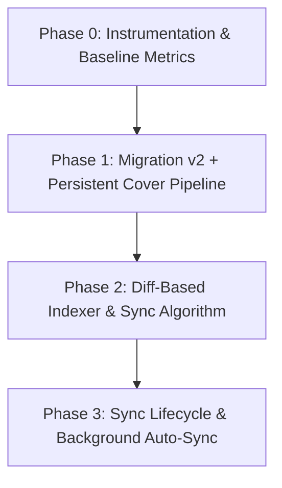

# Kế Hoạch Chi Tiết: Migrate IndexedDB & Tối Ưu Đồng Bộ (Phase 0 → 3)
*Tuân thủ kiến trúc SOLID & Quy chuẩn Fullstack Orchestrate*

---

## 📌 1. Mục tiêu & Bối cảnh Kiến trúc

### 1.1. Hiện trạng & Thách thức
1. **Mất ảnh bìa (Cover Art) sau khi Reload:** Hiện tại `coverBlobUrl` lưu trực tiếp URL dạng `blob:http://...` từ `URL.createObjectURL()`. Khi người dùng reload hoặc đóng tab, toàn bộ các pointer này bị hủy (dead pointers).
2. **Scan toàn bộ (Full Rescan) gây lãng phí & Rate Limit:** `indexer.ts` quét lại 100% tất cả các file từ đầu mỗi lần bấm scan, tải 512KB cho từng file trên Google Drive không qua diffing, dễ gây nghẽn mạng và chạm trần Google Anti-Bot.
3. **Memory Leak (Rò rỉ bộ nhớ):** Chưa có cơ chế giải phóng (`URL.revokeObjectURL()`) vòng đời cho các object URL trong audio streaming và cover art.

### 1.2. Áp dụng Nguyên tắc SOLID trong Thiết kế Mới
* **Single Responsibility Principle (S):**
  * `db/database.ts`: Chỉ định nghĩa schema và migration version.
  * `services/metadata.service.ts`: Chỉ bóc tách metadata và nén ảnh sang binary blob thô. Không tạo/quản lý URL lifecycle.
  * `hooks/useCoverUrl.ts`: Quản lý vòng đời cấp phát (`createObjectURL`) và thu hồi (`revokeObjectURL`) của cover art.
  * `services/syncService.ts` / `db/indexer.ts`: Đảm nhận thuật toán so khớp (diffing) và đồng bộ theo lô (batch upsert).
* **Open/Closed Principle (O):**
  * Thiết kế `StorageFile` và fingerprint (`md5Checksum`, `modifiedTime`, `size`) mở rộng qua `base.provider.ts` mà không làm vỡ các provider khác (`LOCAL`, `S3`).
* **Liskov Substitution Principle (L):**
  * Mọi provider (`GoogleDriveProvider`, `LocalStorageProvider`, `S3StorageProvider`) kế thừa chuẩn `IStorageProvider`.
* **Interface Segregation Principle (I):**
  * Tách biệt interface của `StorageFile`, `StorageSource`, `Song` và bảng `CoverRecord` riêng biệt.
* **Dependency Inversion Principle (D):**
  * UI components phụ thuộc vào abstraction hook (`useCoverUrl`, `useLibrary`, `useAudio`), không truy vấn trực tiếp IndexedDB hay tạo Object URL tùy tiện trong JSX.

---

## 🗄️ 2. Schema Migration: Dexie Version 1 → Version 2

### 2.1. Bảng so sánh Schema

| Bảng | Thay đổi trường | Khóa & Index | Ghi chú |
|---|---|---|---|
| **`songs`** | Thêm `remoteId`, `remoteFingerprint`, `remoteSize`, `remoteModifiedTime`, `indexStatus` (`'ok'` \| `'parse_failed'` \| `'missing'`), `missingSince?`, `coverId?` | `id, sourceId, title, artist, album, duration, format, year, [sourceId+remoteId], indexStatus` | `[sourceId+remoteId]` phục vụ so khớp diffing nhanh |
| **`albums`** | Thêm `coverId?` | `id, title, artist, year` | Giữ nguyên index |
| **`sources`** | Thêm `lastSyncAt?`, `lastSyncResult?` | `id, name, type, enabled` | Theo dõi trạng thái sync |
| **`covers`** *(mới)* | `{ id: string, blob: Blob, mimeType: string }` | `id` (Primary Key - SHA-1 Hash) | Lưu bền vững Blob ảnh bìa đã nén |
| **`playlists`** | Giữ nguyên | `id, name, createdAt` | `songIds: string[]` liên kết giữ nguyên |
| **`history`** | Giữ nguyên | `id, songId, playedAt` | `songId: string` liên kết giữ nguyên |

> **Quy ước Deterministic ID đã xác minh:**
> - `song.id`: `${source.id}:${file.id}` (ví dụ: `src-123:1G4k...`). Trong migration, `remoteId` được tách trực tiếp từ phần sau dấu `:` đầu tiên của `song.id`.
> - `album.id`: `alb:${cleanAlbumTitle}:::${cleanArtistName}`.
> - `artist.id`: `art:${cleanArtistName}`.
> - Không làm thay đổi `song.id` => `playlists` và `history` được bảo toàn 100%.

### 2.2. Chi tiết Migration Code (`src/db/database.ts`)

```typescript
// Version 2 Schema
this.version(2)
  .stores({
    sources: 'id, name, type, enabled',
    songs: 'id, sourceId, title, artist, album, duration, format, year, [sourceId+remoteId], indexStatus',
    albums: 'id, title, artist, year',
    artists: 'id, name',
    playlists: 'id, name, createdAt',
    history: 'id, songId, playedAt',
    covers: 'id',
  })
  .upgrade(async (tx) => {
    // 1. Chuẩn hóa dữ liệu songs cũ
    await tx.table('songs').toCollection().modify((song: any) => {
      song.indexStatus = 'ok';
      song.coverId = undefined;
      song.coverBlobUrl = undefined; // Dọn dẹp URL rác đã hỏng

      if (song.id && song.id.includes(':')) {
        const parts = song.id.split(':');
        song.remoteId = parts.slice(1).join(':');
      } else {
        song.remoteId = song.path || song.id;
      }
    });

    // 2. Chuẩn hóa albums cũ
    await tx.table('albums').toCollection().modify((album: any) => {
      album.coverId = undefined;
      album.coverBlobUrl = undefined;
    });
  });
```

---

## 🚀 3. Kế Hoạch Triển Khai Từng Giai Đoạn (Phase 0 → 3)



---

### 📊 Phase 0: Instrumentation & Baseline Metrics
* **Mục tiêu:** Đo lường hiệu năng hiện tại (baseline) trước khi tối ưu để so sánh định lượng.
* **Nhiệm vụ:**
  1. Tạo `src/utils/syncMetrics.ts`:
     * Đếm số request `/api/gdrive/files`.
     * Đếm số request `readRange` (512KB chunk).
     * Đếm số bài parse thành công / thất bại.
     * Đo tổng thời gian scan và thời gian render thư viện sau khi mở trang.
  2. Tích hợp log nhẹ vào console trong `indexer.ts`.

---

### 🖼️ Phase 1: Migration + Persistent Cover Pipeline
* **Mục tiêu:** Giải quyết dứt điểm lỗi mất ảnh bìa khi F5/reload và rò rỉ bộ nhớ.
* **Tệp thay đổi / tạo mới:**
  * `src/db/database.ts`: Khai báo `version(2)` + migration script.
  * `src/types/index.ts`: Bổ sung `CoverRecord`, `coverId?`, `indexStatus`, `remoteFingerprint`.
  * `src/services/metadata.service.ts`:
    * Trích xuất binary blob ảnh thô.
    * Nén ảnh client-side qua `createImageBitmap` + Canvas về tối đa 500x500px, xuất JPEG chất lượng 0.85.
    * Sinh `coverId = SHA-1` bằng Web Crypto API (`crypto.subtle.digest`).
    * Trả về `{ coverId, coverBlob, mimeType: 'image/jpeg' }`.
  * `src/hooks/useCoverUrl.ts` *(mới)*:
    * Nhận `coverId?: string`.
    * Đọc blob từ `db.covers.get(coverId)` và tạo Object URL.
    * Tự động gọi `URL.revokeObjectURL()` khi component unmount hoặc `coverId` thay đổi.
  * **Cập nhật UI Components:** Thay thế `coverBlobUrl` bằng `useCoverUrl(song.coverId || album.coverId)` trong:
    * `src/views/SongsView.tsx`
    * `src/views/AlbumsView.tsx`
    * `src/components/player/PlayerDock.tsx`
    * `src/components/player/LiveQueueDrawer.tsx`
    * `src/components/modals/SongDetailModal.tsx`
    * `src/components/modals/AlbumDetailModal.tsx`
  * `src/App.tsx`: Kích hoạt `navigator.storage?.persist()` khi mount để bảo vệ IndexedDB không bị trình duyệt xóa dọn tự động.

---

### ⚡ Phase 2: Indexer Diff-Based (Đồng bộ thông minh)
* **Mục tiêu:** Chỉ tải và phân tích các bài hát thực sự mới hoặc có thay đổi trên cloud.
* **Tệp thay đổi:**
  * `api/gdrive/files.ts`:
    * Cập nhật query fields: `fields=files(id,name,mimeType,size,md5Checksum,modifiedTime,webContentLink)`.
  * `src/providers/base.provider.ts`:
    * Mở rộng interface `StorageFile`: thêm `md5Checksum?: string`, `modifiedTime?: string`.
  * `src/providers/gdrive.provider.ts`:
    * Parse và gán `md5Checksum`, `modifiedTime` vào danh sách `StorageFile[]`.
  * `src/db/indexer.ts`:
    * Viết lại thuật toán `LibraryIndexer.syncSource(source, options)`:
      1. **List Remote:** Gọi `provider.listFiles()` lấy danh sách đầy đủ. (Nếu lỗi mạng: hủy sync an toàn, không xóa DB).
      2. **Load Local DB:** `db.songs.where('sourceId').equals(source.id).toArray()`, dựng `Map<remoteId, Song>`.
      3. **Diffing Logic:**
         * `fingerprint = file.md5Checksum || `${file.modifiedTime}:${file.size}``.
         * *Không đổi:* `localSong.remoteFingerprint === fingerprint` ➔ Bỏ qua hoàn toàn, không gọi `readRange`.
         * *Legacy (vừa migrate, chưa có fingerprint):* Cập nhật `remoteFingerprint = fingerprint`, giữ nguyên metadata cũ, không tải lại.
         * *Mới / Đổi:* Đưa vào queue phân tích (Concurrency = 2, delay 80ms chống anti-bot).
         * *Missing:* File có trong DB nhưng không có trên Drive ➔ Đánh dấu `indexStatus = 'missing'`, `missingSince = ISOString`.
      4. **Batch Upsert:** Ghi transaction Dexie theo từng lô 50 bài vào `songs` và `covers`.
      5. **Legacy Album Cover Healing:** Với các album chưa có `coverId`, chỉ chọn **1 bài đại diện** để `readRange` lấy cover cho toàn bộ album.
      6. **Hoàn tất:** Cập nhật `sources.update(source.id, { lastSyncAt: ISOString, lastSyncResult: 'ok' })`.

---

### 🔄 Phase 3: Sync Lifecycle & Background Auto-Sync
* **Mục tiêu:** Quản lý vòng đời đồng bộ, tự động chạy nền không chặn UI.
* **Tệp thay đổi / tạo mới:**
  * `src/services/syncService.ts` (hoặc mở rộng `LibraryContext.tsx`):
    * Quản lý trạng thái: `idle | syncing | completed | failed | source_unreachable`.
    * **Single-Flight Lock:** `Map<sourceId, Promise<void>>` ngăn chặn việc gọi sync trùng lặp.
  * `src/contexts/LibraryContext.tsx`:
    * Lọc các bài hát hiển thị: `songs.filter(s => s.indexStatus !== 'missing')`.
    * Cung cấp hàm `syncSource(sourceId, { force?: boolean })`.
  * `src/App.tsx`:
    * Khởi chạy đồng bộ nền qua `requestIdleCallback` (hoặc `setTimeout` sau 2 giây) cho các Cloud Source nếu `lastSyncAt` cũ hơn 10 phút.
    * Tự động bỏ qua khi ngoại tuyến (offline).

---

## 🧪 4. Ma Trận Kiểm Chứng (Acceptance Test Matrix)

| STT | Kịch bản kiểm thử (Acceptance Criteria) | Kết quả mong đợi |
|:---:|---|---|
| **AC-1** | Tải bài hát có ảnh bìa, reload trang / mở tab mới | Ảnh bìa bài hát và album vẫn hiển thị đầy đủ từ `db.covers` |
| **AC-2** | Ngắt kết nối mạng (Offline mode), reload trang | Toàn bộ thư viện và ảnh bìa hiển thị ngay lập tức không bị lỗi |
| **AC-3** | Bấm Sync 2 lần liên tiếp trên cùng một thư mục Google Drive | Lần 2 log: `parse = 0`, `readRange = 0`, hoàn thành trong < 1 giây |
| **AC-4** | Thêm 1 bài hát mới trên Google Drive rồi bấm Sync | Chỉ 1 bài mới được gọi `readRange`, các bài cũ giữ nguyên |
| **AC-5** | Đóng tab/tắt trình duyệt giữa lúc đang Sync | Dữ liệu các lô đã ghi trước đó vẫn nguyên vẹn; mở lại app sẽ sync tiếp phần còn lại |
| **AC-6** | Nạp file audio bị lỗi/corrupt vào Google Drive | Bản ghi được lưu với `indexStatus = 'parse_failed'`, không làm sập tiến trình sync |
| **AC-7** | Nâng cấp từ Database Version 1 hiện có lên Version 2 | Migration tự động chạy thành công, không mất danh sách phát (Playlists) hay Lịch sử (History) |

---

## ⚠️ 5. Kế Hoạch Quản Trị Rủi Ro (Risk Mitigation)

1. **Rủi ro mất dữ liệu khi Migration:**
   * Cơ chế `upgrade()` trong Dexie hoàn toàn không gọi network call, đảm bảo an toàn tuyệt đối trong transaction.
   * Tất cả các trường `id` (`song.id`, `album.id`, `artist.id`) đều giữ nguyên quy ước deterministic ban đầu.
2. **Rủi ro thẻ Cover Art vượt quá 512KB đầu:**
   * Nếu không trích xuất được trong 512KB, hệ thống gán `coverId = undefined` và giữ bài hát ở trạng thái `ok`, không làm gián đoạn việc phát nhạc.
3. **Rủi ro Quá tải / Rate Limit Google Drive:**
   * Giữ concurrency ở mức thấp (2 luồng đồng thời) kết hợp delay 80ms giữa các request.
   * Xử lý HTTP 429 với Retry-After backoff tự động.
