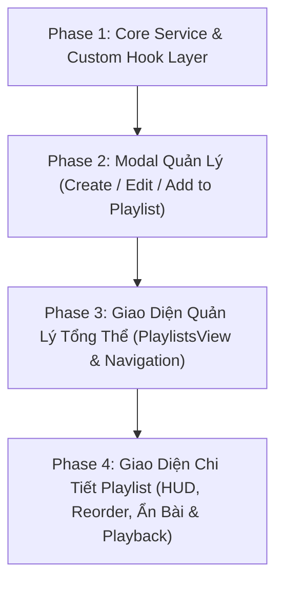

# Kế Hoạch Chi Tiết: Phát Triển Module Playlist & Quản Lý Ẩn Bài Hát (Phases 1 → 4)
*Tuân thủ nguyên tắc SOLID & Quy chuẩn Fullstack Orchestrate*

---

## 📌 1. Mục Tiêu & Yêu Cầu Nghiệp Vụ

### 1.1. Hiện trạng & Nhu cầu
1. **Thiếu tính năng Playlist hoàn chỉnh**: Giao diện `ViewRouter.tsx` và `Sidebar.tsx` đã định nghĩa tab `playlists`, nhưng chưa có màn hình quản lý, hiển thị và thao tác playlist.
2. **Quản lý danh sách bài hát linh hoạt**: Người dùng cần khả năng tạo nhiều playlist, phân loại nhạc cá nhân, chỉnh sửa thông tin (tên, mô tả, ảnh bìa).
3. **Tính năng Ẩn bài hát (Hidden Songs)**: Người dùng muốn giữ một bài hát trong playlist nhưng tạm thời không muốn phát khi chạy `Play All` hoặc `Shuffle`, và có thể khôi phục lại khi cần.
4. **Tích hợp thêm bài nhanh từ mọi nơi**: Cho phép thêm trực tiếp bài hát vào playlist từ màn hình Tất cả bài hát (`SongsView`), Album (`AlbumsView`), hoặc Studio Wall Monitor (`SongDetailModal`).

### 1.2. Áp dụng Nguyên tắc SOLID trong Thiết kế Module

* **Single Responsibility Principle (S):**
  * `services/playlistService.ts`: Chịu trách nhiệm duy nhất về logic dữ liệu Playlist (Tạo, Sửa, Xóa, Thêm/Bớt bài hát, Sắp xếp Reorder, Ẩn/Hiện bài hát).
  * `hooks/usePlaylists.ts`: Đảm nhận reactive state với `useLiveQuery` từ Dexie và dispatch các action nghiệp vụ.
  * `views/PlaylistsView.tsx`: Chỉ đảm nhận render giao diện danh sách Playlist (Grid cards, Search & Sort, Create trigger).
  * `components/modals/PlaylistDetailModal.tsx`: Chịu trách nhiệm hiển thị chi tiết bài hát trong playlist, HUD điều khiển phát, kéo thả sắp xếp và quản lý bài ẩn.
  * `components/modals/CreatePlaylistModal.tsx` & `AddToPlaylistModal.tsx`: Đảm nhận form tạo/sửa và popup chọn playlist.
* **Open/Closed Principle (O):**
  * Interface `Playlist` mở rộng dễ dàng với các trường mới (`isPinned`, `tags`, `customColor`, `coverId`) mà không làm ảnh hưởng đến các entity khác (`Song`, `Album`, `Source`).
* **Liskov Substitution Principle (L):**
  * Danh sách bài hát lấy từ Playlist tuân thủ đầy đủ schema `Song[]`, tái sử dụng trọn vẹn Audio Engine trong [`AudioContext.tsx`](file:///d:/Data/Personal/STUDY/PROGRAMMING/REACT/music-player/frontend-nodb/src/contexts/AudioContext.tsx) (`playSong(song, playlistSongs)`).
* **Interface Segregation Principle (I):**
  * Tách biệt rõ ràng các DTO: `CreatePlaylistDTO`, `UpdatePlaylistDTO`, `PlaylistWithStats`, `PlaylistSongItem`.
* **Dependency Inversion Principle (D):**
  * Các UI Component không bao giờ gọi trực tiếp `db.playlists.add(...)` hay `db.playlists.update(...)` trong JSX, mà hoàn toàn phụ thuộc vào custom hook `usePlaylists()`.

---

## 🗄️ 2. Mô Hình Dữ Liệu & Schema (IndexedDB / Dexie)

### 2.1. Cấu trúc Interface (`src/types/index.ts`)

```typescript
export interface Playlist {
  id: string;                // UUID hoặc deterministic key (pl_timestamp_rand)
  name: string;              // Tên playlist (bắt buộc, max 100 ký tự)
  description?: string;       // Mô tả playlist
  coverId?: string;          // ID ảnh bìa đại diện (từ CoverRecord)
  songIds: string[];         // Mảng danh sách ID bài hát theo đúng thứ tự phát
  hiddenSongIds?: string[];  // Danh sách ID bài hát bị ẩn trong playlist này
  isPinned?: boolean;        // Ghim playlist lên đầu danh sách
  createdAt: string;         // ISO Date string
  updatedAt: string;         // ISO Date string
}

export interface CreatePlaylistDTO {
  name: string;
  description?: string;
  initialSongIds?: string[];
  coverId?: string;
}

export interface UpdatePlaylistDTO {
  name?: string;
  description?: string;
  coverId?: string;
  songIds?: string[];
  hiddenSongIds?: string[];
  isPinned?: boolean;
}

export interface PlaylistWithStats extends Playlist {
  songs: Song[];             // Danh sách object Song thật lấy từ db.songs
  validSongs: Song[];        // Danh sách các bài hát không bị ẩn (cho Play All/Shuffle)
  hiddenSongs: Song[];       // Danh sách các bài hát bị ẩn
  totalDuration: number;     // Tổng thời lượng (giây)
  formattedDuration: string; // "1 giờ 15 phút" hoặc "45 phút"
  coverUrl?: string | null;  // URL blob ảnh bìa bài đầu tiên nếu playlist chưa có coverId riêng
}
```

### 2.2. Khả năng tương thích Schema Dexie
* Bảng `playlists` trong Dexie đã có index `id, name, createdAt`.
* `songIds` và `hiddenSongIds` lưu dưới dạng JavaScript Array trong IndexedDB, không cần migration thay đổi index.
* Giá trị mặc định khi đọc: `hiddenSongIds = playlist.hiddenSongIds || []`.

---

## 🚀 3. Kế Hoạch Triển Khai Chi Tiết (Phases 1 → 4)



---

### 🔹 Phase 1: Core Service & Custom Hook Layer (`playlistService.ts` & `usePlaylists.ts`)
* **Mục tiêu:** Xây dựng tầng nghiệp vụ dữ liệu độc lập, kiểm thử logic CRUD, reorder và ẩn bài.
* **Các file triển khai:**
  1. [`frontend-nodb/src/services/playlistService.ts`](file:///d:/Data/Personal/STUDY/PROGRAMMING/REACT/music-player/frontend-nodb/src/services/playlistService.ts):
     - `createPlaylist(dto: CreatePlaylistDTO): Promise<Playlist>`
     - `updatePlaylist(id: string, dto: UpdatePlaylistDTO): Promise<void>`
     - `deletePlaylist(id: string): Promise<void>`
     - `addSongsToPlaylist(playlistId: string, songIds: string[]): Promise<void>`
     - `removeSongFromPlaylist(playlistId: string, songId: string): Promise<void>`
     - `reorderSongs(playlistId: string, fromIndex: number, toIndex: number): Promise<void>`
     - `toggleHideSong(playlistId: string, songId: string): Promise<boolean>`
     - `togglePinPlaylist(playlistId: string): Promise<boolean>`
  2. [`frontend-nodb/src/hooks/usePlaylists.ts`](file:///d:/Data/Personal/STUDY/PROGRAMMING/REACT/music-player/frontend-nodb/src/hooks/usePlaylists.ts):
     - Cung cấp `playlists: Playlist[]` thông qua `useLiveQuery` từ Dexie.
     - Hàm tính toán stats (`getPlaylistWithStats(playlistId, allSongs)`).
     - Export toàn bộ các hàm mutation với error handling và notification state.

---

### 🔹 Phase 2: Modal Quản Lý & Luồng Tương Tác Nhanh (Create / Edit / Add-To)
* **Mục tiêu:** Cho phép người dùng tạo playlist mới và nhanh chóng đưa bài hát vào playlist từ bất cứ đâu.
* **Các file triển khai:**
  1. [`frontend-nodb/src/components/modals/CreatePlaylistModal.tsx`](file:///d:/Data/Personal/STUDY/PROGRAMMING/REACT/music-player/frontend-nodb/src/components/modals/CreatePlaylistModal.tsx):
     - Form kính mờ Glassmorphism nhập Tên và Mô tả.
     - Hỗ trợ cả 2 chế độ: "Tạo mới" và "Chỉnh sửa" playlist có sẵn.
  2. [`frontend-nodb/src/components/modals/AddToPlaylistModal.tsx`](file:///d:/Data/Personal/STUDY/PROGRAMMING/REACT/music-player/frontend-nodb/src/components/modals/AddToPlaylistModal.tsx):
     - Hiển thị danh sách tất cả playlist của người dùng kèm checkbox / click nhanh.
     - Hiển thị trạng thái bài hát đã có trong playlist hay chưa (`Đã có` / `Thêm vào`).
     - Tích hợp nút "Tạo playlist mới" ngay trong modal nếu chưa có playlist phù hợp.
  3. **Tích hợp nút "Thêm vào Playlist"**:
     - Thêm action vào menu 3 chấm / action button ở danh sách bài hát [`SongsView.tsx`](file:///d:/Data/Personal/STUDY/PROGRAMMING/REACT/music-player/frontend-nodb/src/views/SongsView.tsx).
     - Thêm nút "Thêm tất cả vào Playlist" trong [`AlbumDetailModal.tsx`](file:///d:/Data/Personal/STUDY/PROGRAMMING/REACT/music-player/frontend-nodb/src/components/modals/AlbumDetailModal.tsx).

---

### 🔹 Phase 3: Giao Diện Danh Sách Playlist (`PlaylistsView.tsx`) & Điều Hướng
* **Mục tiêu:** Màn hình duyệt toàn bộ playlist với thiết kế sang trọng, đồng bộ với hệ thống Design Token Amber Gold.
* **Các file triển khai:**
  1. [`frontend-nodb/src/components/playlist/PlaylistCard.tsx`](file:///d:/Data/Personal/STUDY/PROGRAMMING/REACT/music-player/frontend-nodb/src/components/playlist/PlaylistCard.tsx):
     - Card dạng kính mờ (`glass-panel`) với hiệu ứng hover glow viền vàng ấm.
     - Ảnh bìa tạo dạng xếp lớp 4 góc (Dynamic 4-art Grid Collage) từ các bài hát trong playlist.
     - Nút Quick Play nhanh trên thẻ mà không cần mở modal.
     - Badge hiển thị số lượng bài, tổng thời lượng và trạng thái Ghim (`Pin`).
  2. [`frontend-nodb/src/views/PlaylistsView.tsx`](file:///d:/Data/Personal/STUDY/PROGRAMMING/REACT/music-player/frontend-nodb/src/views/PlaylistsView.tsx):
     - Header với thanh tìm kiếm playlist, nút sắp xếp (Mới nhất, Tên A-Z, Số lượng bài) và nút "Tạo Playlist Mới".
     - Empty State sinh động khi chưa có playlist nào.
     - Grid layout responsive (1 cột trên mobile, 2-3 cột trên tablet, 4 cột trên desktop).
  3. **Tích hợp Navigation**:
     - Cập nhật [`Sidebar.tsx`](file:///d:/Data/Personal/STUDY/PROGRAMMING/REACT/music-player/frontend-nodb/src/components/common/Sidebar.tsx): Badge số lượng playlist tự động cập nhật.
     - Cập nhật [`MobileNav.tsx`](file:///d:/Data/Personal/STUDY/PROGRAMMING/REACT/music-player/frontend-nodb/src/components/common/MobileNav.tsx): Tab Playlists với đèn LED active.
     - Đăng ký `viewMode === 'playlists'` trong [`ViewRouter.tsx`](file:///d:/Data/Personal/STUDY/PROGRAMMING/REACT/music-player/frontend-nodb/src/views/ViewRouter.tsx).

---

### 🔹 Phase 4: Giao Diện Chi Tiết Playlist (`PlaylistDetailModal.tsx`) & Ẩn/Hiện Bài Hát
* **Mục tiêu:** Màn hình quản lý bài hát trong playlist, hỗ trợ kéo thả, ẩn bài, lọc tìm kiếm và phát nhạc.
* **Các file triển khai:**
  1. [`frontend-nodb/src/components/modals/PlaylistDetailModal.tsx`](file:///d:/Data/Personal/STUDY/PROGRAMMING/REACT/music-player/frontend-nodb/src/components/modals/PlaylistDetailModal.tsx):
     - **Hero Header**: Ảnh đại diện playlist, Tên, Mô tả, Thông số (Số bài, Thời lượng, Ngày tạo), Nút `Phát tất cả (Play All)`, `Phát ngẫu nhiên (Shuffle)`, `Chỉnh sửa`, `Xóa playlist`.
     - **Toolbar điều khiển**:
       - Ô tìm kiếm bài hát trong playlist.
       - Toggle switch: `Hiện bài hát bị ẩn (Show Hidden Songs)` (hiển thị số lượng bài đang bị ẩn).
       - Nút `Thêm bài hát`.
     - **Danh sách bài hát (`PlaylistItemRow`)**:
       - Đánh số thứ tự (#) / Nút di chuyển lên xuống hoặc Drag Handle để đổi vị trí.
       - Thông tin bài hát: Bìa nhỏ, Tên, Ca sĩ, Album, Định dạng Hi-Res, Thời lượng.
       - **Trạng thái bài ẩn**: Khi bài bị ẩn, hiển thị hiệu ứng mờ `opacity-40`, gạch ngang nhẹ và icon `EyeOff`.
       - **Nút hành động nhanh**:
         - Ẩn / Bỏ ẩn bài hát (`Eye` / `EyeOff`).
         - Xóa khỏi playlist (`Trash2`).
  2. **Tích hợp Audio Engine**:
     - `Play All`: Lấy `validSongs` (loại bỏ toàn bộ bài trong `hiddenSongIds`) và truyền vào `playSong(firstValidSong, validSongs)`.
     - `Shuffle Play`: Trộn ngẫu nhiên `validSongs` và phát.
     - Phát từng bài trong playlist: Nếu người dùng bấm phát thủ công một bài (kể cả bài đang ẩn), trình phát vẫn phát bài đó và thiết lập hàng đợi phát tương ứng.

---

## 🧪 4. Ma Trận Nghiệm Thu (Acceptance Criteria & Test Matrix)

| Mã AC | Kịch bản kiểm thử | Kết quả mong đợi |
|---|---|---|
| **AC-1** | Tạo playlist mới với tên "Nhạc Tuyển Chọn" | Playlist xuất hiện ngay lập tức trên UI và lưu trong Dexie `playlists`. |
| **AC-2** | Thêm 3 bài hát từ `SongsView` vào playlist | `playlist.songIds` cập nhật chứa 3 ID bài hát, card hiển thị 3 bài. |
| **AC-3** | Đổi tên playlist và cập nhật mô tả | Dữ liệu cập nhật real-time không cần reload trang. |
| **AC-4** | Ẩn 1 bài hát trong playlist | Bài hát chuyển sang trạng thái mờ với icon `EyeOff`. |
| **AC-5** | Bấm `Play All` khi có 1 bài đang bị ẩn | Audio Player chỉ phát các bài hợp lệ, bỏ qua hoàn toàn bài bị ẩn trong Queue. |
| **AC-6** | Bật/tắt toggle "Hiện bài hát bị ẩn" | Danh sách chuyển đổi mượt mà giữa việc hiển thị đủ hoặc chỉ hiện bài hợp lệ. |
| **AC-7** | Bấm `Bỏ ẩn (Unhide)` cho bài hát bị ẩn | Bài hát trở lại bình thường và tự động tham gia lại vào danh sách phát `Play All`. |
| **AC-8** | Xóa bài hát khỏi playlist | Bài hát bị loại khỏi `songIds` và `hiddenSongIds`, thứ tự các bài còn lại giữ nguyên. |
| **AC-9** | Di chuyển / Sắp xếp lại thứ tự bài hát | Thứ tự phát mới được lưu bền vững vào IndexedDB. |
| **AC-10**| Xóa toàn bộ Playlist | Xuất hiện modal xác nhận an toàn, sau khi xóa dữ liệu biến mất khỏi Dexie, các bài hát gốc trong thư viện vẫn an toàn 100%. |

---

## 🛠️ 5. Thứ Tự Triển Khai Khuyến Nghị (Step-by-Step)

1. **Bước 1**: Viết `playlistService.ts` & `usePlaylists.ts` (Phase 1).
2. **Bước 2**: Tạo `CreatePlaylistModal.tsx` & `AddToPlaylistModal.tsx` (Phase 2).
3. **Bước 3**: Tạo `PlaylistsView.tsx`, `PlaylistCard.tsx` và gắn vào `Sidebar.tsx`, `MobileNav.tsx`, `ViewRouter.tsx` (Phase 3).
4. **Bước 4**: Hoàn thiện `PlaylistDetailModal.tsx` với toàn bộ logic Ẩn/Hiện, Reorder và Phát nhạc (Phase 4).
5. **Bước 5**: Kiểm thử loại trừ lỗi Type và kiểm thử tương tác người dùng.
