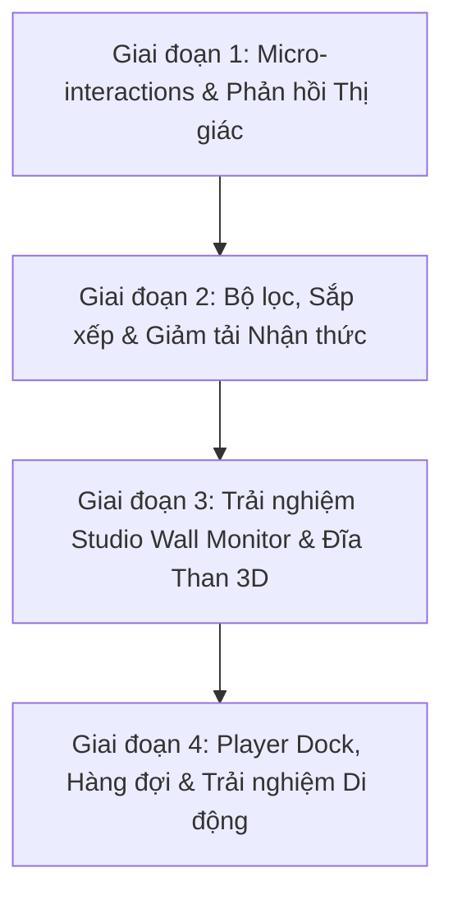

# Kế Hoạch Nâng Cấp UI/UX Toàn Diện - MusicVault (NoDB)

## 📌 1. Mục tiêu & Định hướng Thiết kế
Kế hoạch này vạch ra lộ trình nâng cấp giao diện người dùng (UI) và tối ưu hóa trải nghiệm tương tác (UX) cho dự án **`frontend-nodb`** dựa trên các giá trị thiết kế đúc kết từ bản tiền nhiệm, tuân thủ nghiêm ngặt nguyên tắc **SOLID** và quy chuẩn của `fullstack-orchestrate`.

---

## 🎨 2. Hệ Thống Design System & Bảng Màu Tập Trung (Single Source of Truth)

Tất cả màu sắc và hiệu ứng giao diện được cấu hình duy nhất tại `:root` trong [`frontend-nodb/src/index.css`](file:///d:/Data/Personal/STUDY/PROGRAMMING/REACT/music-player/frontend-nodb/src/index.css):

| Token | Mã HEX / RGBA | Tên sắc độ | Vai trò trong giao diện |
| :--- | :--- | :--- | :--- |
| `--vault-bg` | `#0C0A09` | **Stone 950** | Nền thẳm chính toàn ứng dụng |
| `--vault-text` | `#FAFAF9` | **Stone 50** | Chữ tiêu đề có độ tương phản cao |
| `--vault-muted` | `#A8A29E` | **Stone 400** | Chữ phụ, metadata nghệ sĩ / album |
| `--vault-accent` | `#F59E0B` | **Amber 500** | Màu nhấn chính (Nút Play, Seekbar, Active Nav) |
| `--vault-bronze` | `#D97706` | **Amber 600** | Màu đồng kim loại (Viền đĩa than, Badges Lossless) |
| `--vault-glass` | `rgba(28, 25, 23, 0.65)` | **Smoked Glass** | Kính hun khói mặt lưng thẻ card, sidebar, dock |
| `--vault-border` | `rgba(217, 119, 6, 0.15)` | **Amber Rim** | Viền phản quang 1px tạo độ nẩy khối của tấm kính |
| `--vault-glow` | `rgba(245, 158, 11, 0.12)` | **Tube Glow** | Quầng sáng ấm bóng đèn điện tử sau phím bấm và đĩa xoay |

---

## 🗺️ 3. Lộ Trình Triển Khai Chi Tiết (4 Giai Đoạn)

---

### 🔹 Giai đoạn 1: Micro-Interactions & Phản hồi Thị giác
#### 1.1. Danh sách bài hát ([SongsView.tsx](file:///d:/Data/Personal/STUDY/PROGRAMMING/REACT/music-player/frontend-nodb/src/views/SongsView.tsx))
- [x] **Chuyển đổi số thứ tự sang Play Icon**: Khi hover chuột vào hàng bài hát, số thứ tự chuyển mượt mà sang icon `Play` với màu vàng hổ phách `#F59E0B`.
- [x] **Chỉ báo bài hát đang phát (Active Playing Cue)**:
  - Khi bài hát đang phát (`isCurrent`), thay thế số thứ tự bằng dải sóng âm mini (`Equalizer spectrum`) nhấp nháy theo nhạc.
  - Tên bài hát đổi sang màu Accent `#F59E0B` và nền hàng nổi bật với `bg-vault-accent/15`.
- [x] **Định dạng thời lượng Tabular**: Sử dụng `font-mono` và `tabular-nums` cho cột thời lượng và thông số kỹ thuật để tránh giật giao diện.

#### 1.2. Thẻ Album ([AlbumsView.tsx](file:///d:/Data/Personal/STUDY/PROGRAMMING/REACT/music-player/frontend-nodb/src/views/AlbumsView.tsx))
- [x] **Hiệu ứng Kính Nổi (Glass Elevation)**: Khi rê chuột vào card album, card nâng nhẹ lên `translate-y-(-3px)` kết hợp tăng độ sáng viền phản quang `border-amber-500/35`.
- [x] **Nút Phát Nhanh Lơ Lửng (Quick Play Hover Button)**: Nút Play tròn nổi bật trượt êm ái từ góc dưới bên phải bìa album (`group-hover:translate-y-0 opacity-100`).
- [x] **Fallback Artwork Đĩa Than Xoay**: Khi album không có ảnh bìa, hiển thị đồ họa mâm đĩa than xoay nhẹ thay vì để trống.

#### 1.3. Thẻ Nghệ sĩ ([ArtistsView.tsx](file:///d:/Data/Personal/STUDY/PROGRAMMING/REACT/music-player/frontend-nodb/src/views/ArtistsView.tsx))
- [x] **Avatar Nghệ sĩ Phản chiếu Quang học**: Avatar tròn với hiệu ứng viền ánh kim Amber, phóng to nhẹ `scale-105` khi hover.

---

### 🔹 Giai đoạn 2: Bộ lọc, Sắp xếp & Giảm Tải Nhận Thức

#### 2.1. Thanh Điều Khiển & Bộ Lọc Nhanh (Filter Chips & Sort Bar)
- [x] **Filter Chips**:
  - `Tất cả`: Hiển thị toàn bộ danh sách.
  - `Hi-Res 24-bit / Lossless`: Lọc nhanh các bản nhạc chuẩn phòng thu (FLAC / WAV).
  - `Định dạng (Format)`: Lọc theo định dạng file cụ thể.
- [x] **Dropdown Sắp Xếp Linh Hoạt**:
  - Sắp xếp theo: *Nghệ sĩ (A-Z)*, *Năm phát hành*, *Tên bài hát/Album*, hoặc *Thời lượng*.
- [x] **Thanh Thống Kê Thư Viện**:
  - Hiển thị tổng thời lượng phát của toàn bộ thư viện hoặc từng album.

#### 2.2. Xử lý Trạng thái Rỗng & Loading (Empty States)
- [x] Tích hợp minh họa đồ họa với mâm đĩa than mờ và nút kêu gọi hành động (CTA) "Thêm nguồn nhạc" rõ ràng khi chưa có dữ liệu.

---

### 🔹 Giai đoạn 3: Trải nghiệm Studio Wall Monitor & Đĩa Than 3D

#### 3.1. Studio Wall Monitor ([SongDetailModal.tsx](file:///d:/Data/Personal/STUDY/PROGRAMMING/REACT/music-player/frontend-nodb/src/components/modals/SongDetailModal.tsx))
- [x] **Chuyển Cảnh Album 60FPS (Pure GPU Swap)**: Khi đổi bài hát, bìa album trượt vào và đĩa than nảy nhẹ (`animate-album-swap`, `animate-vinyl-pull`) hoàn toàn mượt mà.
- [x] **Đồng Hồ Số Thời Gian Thực & Ngày Tháng**: Hiển thị phong cách Studio Hi-Fi với font `JetBrains Mono`.
- [x] **Dynamic Ambient Backdrop**: Nền làm mờ tự động hòa trộn theo màu sắc của ảnh bìa bài hát đang phát (thông qua `useCoverUrl`).
- [x] **Audio Spectrum Visualizer**: Dải 5 cột sóng âm thanh vàng hổ phách nhảy theo nhịp điệu.

#### 3.2. Đĩa Than 3D ([VinylRecord.tsx](file:///d:/Data/Personal/STUDY/PROGRAMMING/REACT/music-player/frontend-nodb/src/components/common/VinylRecord.tsx))
- [x] Vân rãnh đĩa than đồng tâm độ nét cao, nhãn tâm đĩa màu vàng kim Amber sang trọng và quầng sáng ống đèn điện tử (Tube Glow).

---

### 🔹 Giai đoạn 4: Player Dock, Hàng Đợi & Trải Nghiệm Di Động

#### 4.1. Thanh Phát Nhạc Nổi ([PlayerDock.tsx](file:///d:/Data/Personal/STUDY/PROGRAMMING/REACT/music-player/frontend-nodb/src/components/player/PlayerDock.tsx))
- [x] **Thanh Seekbar Công Thái Học**: Mở rộng độ dày và núm kéo khi hover (`h-2 -> h-2.5`, `scale-110`), tích hợp quầng sáng Amber khi chạm vào.
- [x] **Nút Play/Pause Trung Tâm**: Nút to nhất với bóng đổ nổi `shadow-lg shadow-amber-500/40`.
- [x] **Live Queue Drawer ([LiveQueueDrawer.tsx](file:///d:/Data/Personal/STUDY/PROGRAMMING/REACT/music-player/frontend-nodb/src/components/player/LiveQueueDrawer.tsx))**: Khung hàng đợi trượt êm từ cạnh phải, hỗ trợ hiển thị đĩa than và bài hát active.

#### 4.2. Giao Diện Di Động (Mobile Ergonomics)
- [x] **Mobile Mini Player**: Cố định ngay phía trên thanh điều hướng dưới, chạm nhẹ để mở Studio Wall Monitor toàn màn hình.
- [x] **Mobile Drawer Navigation ([MobileNav.tsx](file:///d:/Data/Personal/STUDY/PROGRAMMING/REACT/music-player/frontend-nodb/src/components/common/MobileNav.tsx))**: Menu trượt mượt mà với nền kính mờ đen than ấm và đèn báo active glow.

---

## ✅ 4. Tiêu Chuẩn Đánh Giá Hoàn Thành (Definition of Done)

1. **Kiểm tra Thẩm mỹ & Trải nghiệm**:
   - Giao diện có chiều sâu không gian, các tấm kính phản chiếu ánh sáng đồng nhất.
   - Không có hiện tượng giật số (`Zero Layout Shift`) trên các bộ đếm thời gian.
   - Chuyển động mượt mà ở tần số quét 60FPS.
2. **Kiểm tra Kỹ thuật**:
   - `npm run build` biên dịch thành công mà không có lỗi TypeScript hay cảnh báo style.
   - Hoạt động ổn định trên cả máy tính bàn, laptop và thiết bị di động.
